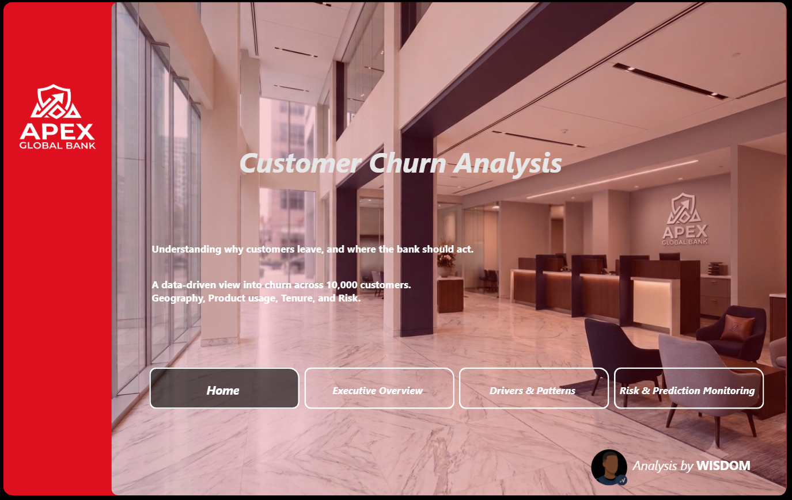
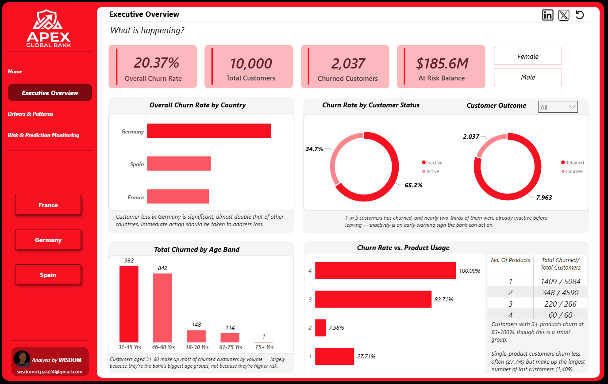
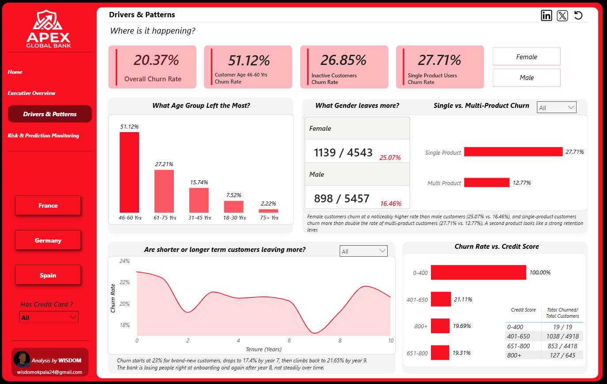
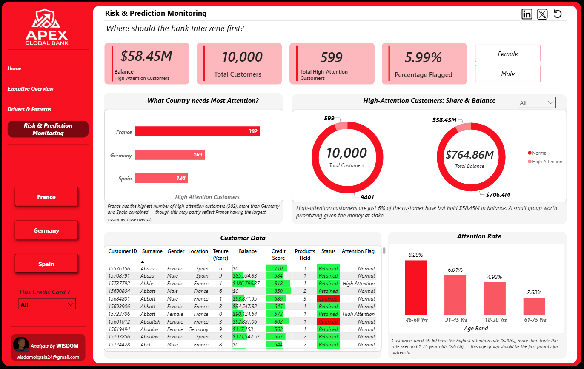

# Bank Customer Churn Analysis — Power BI Dashboard

🔗 **[View the Interactive Dashboard](https://rebrand.ly/d1lmvuv)**

A 4-page Power BI dashboard analyzing customer churn for a bank with 10,000 customers across 3 countries (France, Germany, Spain), built to identify who's leaving, why, and where the bank should focus retention efforts.

## 📊 Dashboard Pages

### Home

### Executive Overview

### Drivers & Patterns

### Risk & Prediction Monitoring

## 🔍 Key Findings
- Germany's churn rate is almost double that of France and Spain
- Customers aged 46-60 account for the largest share of churned customers
- Female customers churn at a higher rate than male customers (25% vs. 16%)
- Single-product customers churn more than double the rate of multi-product customers
- Churn peaks at onboarding and again after year 8 of tenure
- Inactive customers churn significantly more, making activity level a strong early-warning signal

## 💡 Recommendation
Prioritize outreach to inactive, single-product customers in Germany — particularly those aged 46-60 — as this segment carries the highest combined churn risk.

## 🛠 Tools
Power BI · Power Query · DAX

---
## 📌 Connect with me on [LinkedIn](https://www.linkedin.com/in/chidera-okpala-22417730a/) or [X](https://x.com/PrimeW1sdom).
